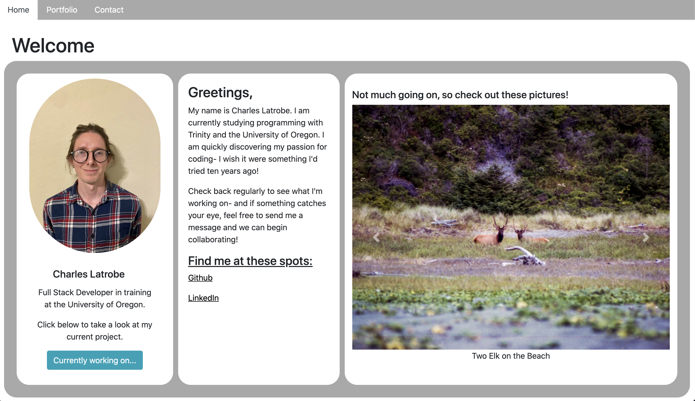
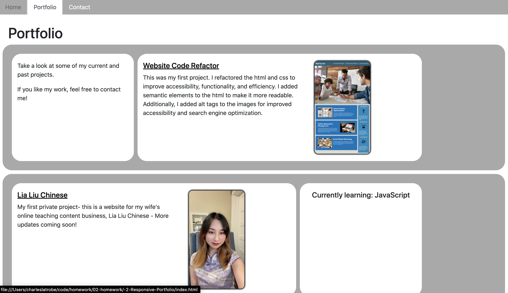
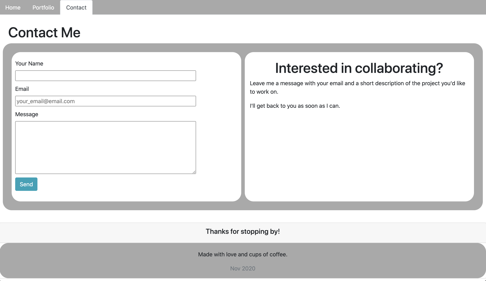
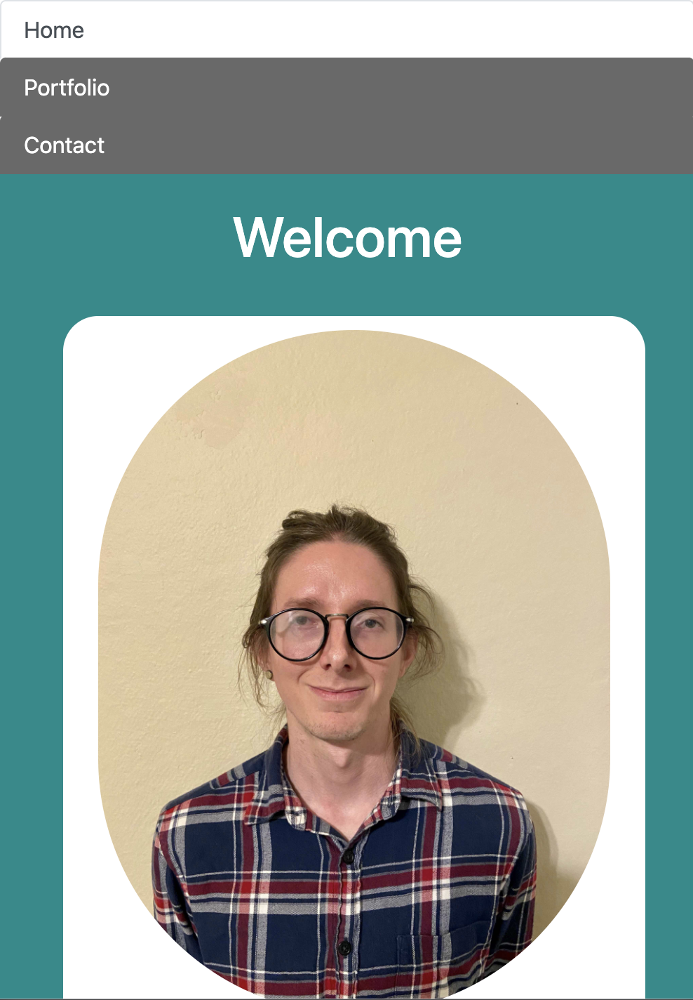
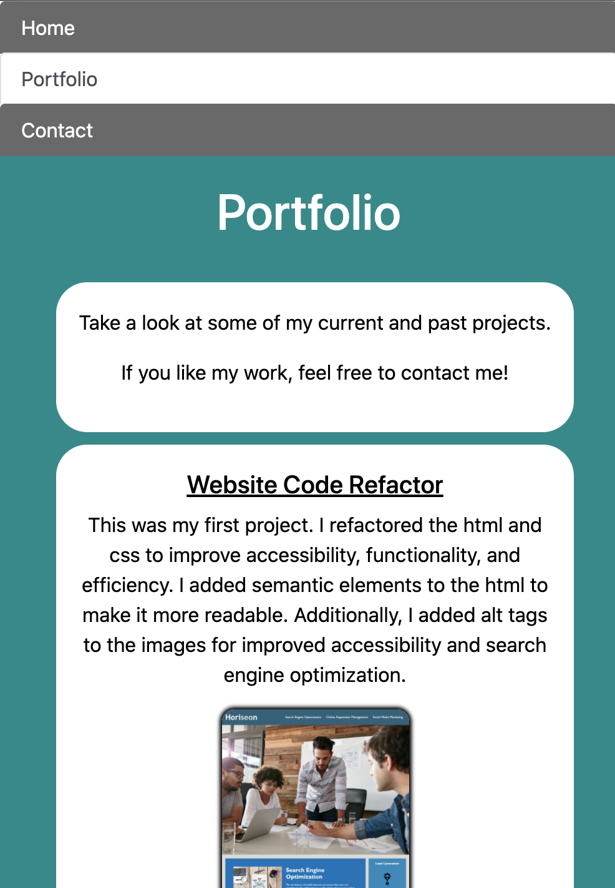
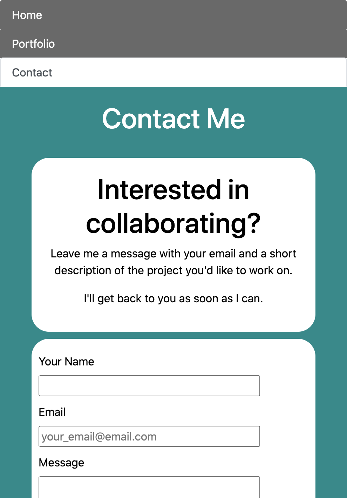

# -2-Responsive-Portfolio

A responsive personal website that contains a home section with basic information, a portfolio tab with links to my work, and a contact tab with a form to contact me for projects.

My personal site is deployed at the following url: https://clatrobe00.github.io/-2-Responsive-Portfolio/index.html

My website is responsive for smart devices, and currently functions on both laptop and mobile browsers.

My personal site features a home page:

A Portfolio Page:

A Contact Page:

And responsive mobile layouts for each:

Home Mobile:

Portfolio Mobile:

Contact Mobile

I am currently working towards adding functionality to the contact form on my contact page.
